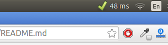
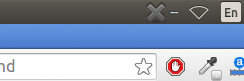
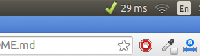

# Ping Check Indicator
App Indicator that keeps pinging a particular server and shows the ping status in menu bar so that you never have to manually check for ping status.

## Features:
 * Pause/resume the ping check operation
 * Adjust the ping check time interval

## Usage:

    git clone https://github.com/sahildua2305/ping-check.git
    cd ping-check
    python ping-check &

## PPA
    sudo add-apt-repository ppa:sahildua2305/ping-check
    sudo apt-get update
    sudo apt-get install ping-check`

###Indicator when connection is up and internet is working.

###Indicator when connection is down or internet isn't working.

###Another example of indicator when internet is working.

